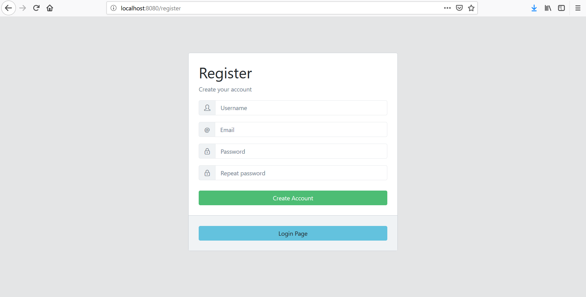
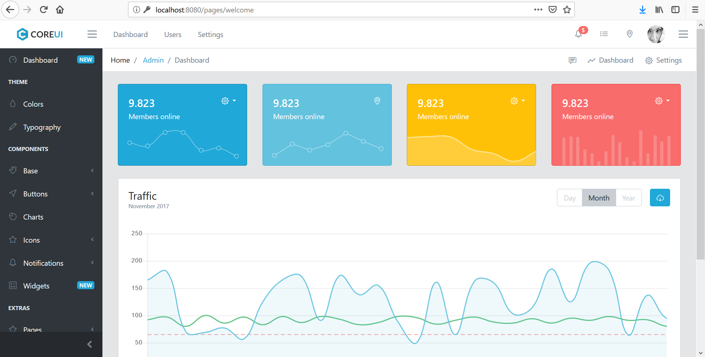

# spring-boot-mustache-core-ui-demo
A simple example Spring Boot Web Admin Template

Technology:
- H2 Database
- Mustache Template Engine
- Core UI Web Admin Template

## Getting started:

`git clone https://github.com/farhanatsani/spring-boot-mustache-core-ui-demo.git`

`cd spring-boot-mustache-core-ui-demo`

`mvn clean install`

`cd target`

`java -jar -Dserver.port=8080 spring-boot-mustache-core-ui-demo-0.0.1-SNAPSHOT.jar`

### Open on browser http://localhost:8080/

| Username | Password |
|:--------:| --------:|
| admin    | admin     |

### H2 console url http://localhost:8080/h2-console

### Screenshot

Login Page

Registration Page

Welcome Page

